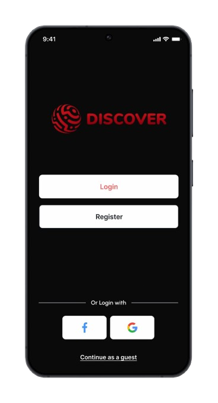
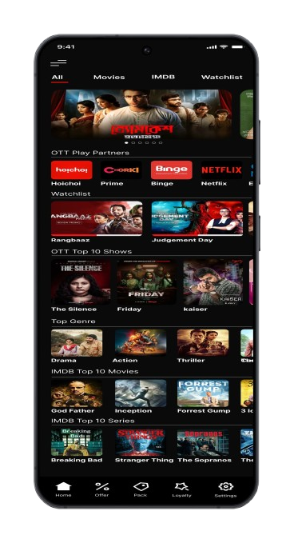
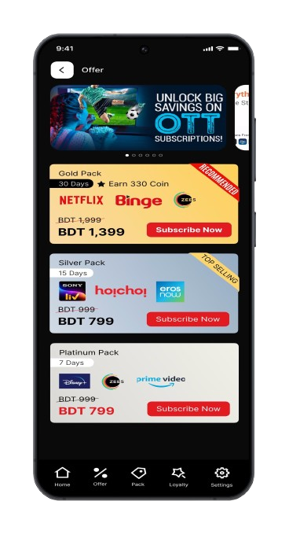
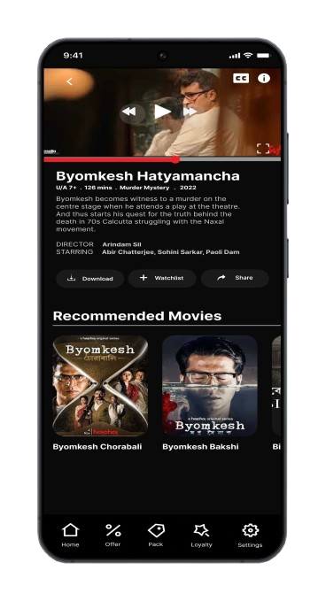
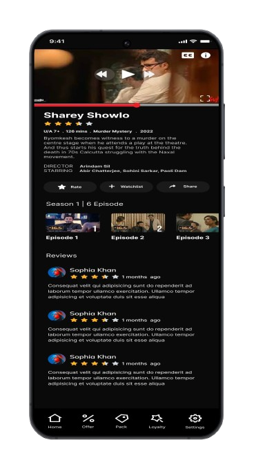

# Discover V2.0

Discover V2.0 is a premium streaming application designed to bring the best of local and international OTT content into a single, unified platform. The app offers users a seamless entertainment experience, providing access to a wide range of movies, shows, and music at highly competitive package prices.

## Key Features

- **Multi-Platform OTT Integration**: Access content from top-tier local and international OTT providers.
- **Affordable Subscription Packages**: Purchase premium OTT bundles at exclusive, budget-friendly rates.
- **Advanced Video Playback**: High-quality video streaming with full support for **HLS (HTTP Live Streaming)**.
- **Universal Media Player**: Play both video and audio content within a single application.
- **Resume Playback**: Pick up right where you left off on your favorite shows and movies.
- **Background Audio Support**: Enjoy uninterrupted music and audio playback even when the app is in the background or the screen is off.

## Technical Architecture

The application is built using **Flutter**, following the **MVVM (Model-View-ViewModel)** architectural pattern to ensure a scalable, maintainable, and testable codebase.

### Core Technologies & Packages
- **State Management**: `provider` for efficient and reactive state handling.
- **Video Playback**: `video_player` (powered by ExoPlayer on Android) for robust HLS streaming.
- **Audio Playback**: `just_audio` for feature-rich audio streaming and background playback.
- **Networking**: `dio` for advanced API interactions and data fetching.

## Screenshots

  
  
  
  
  

---
*Developed with Flutter*
